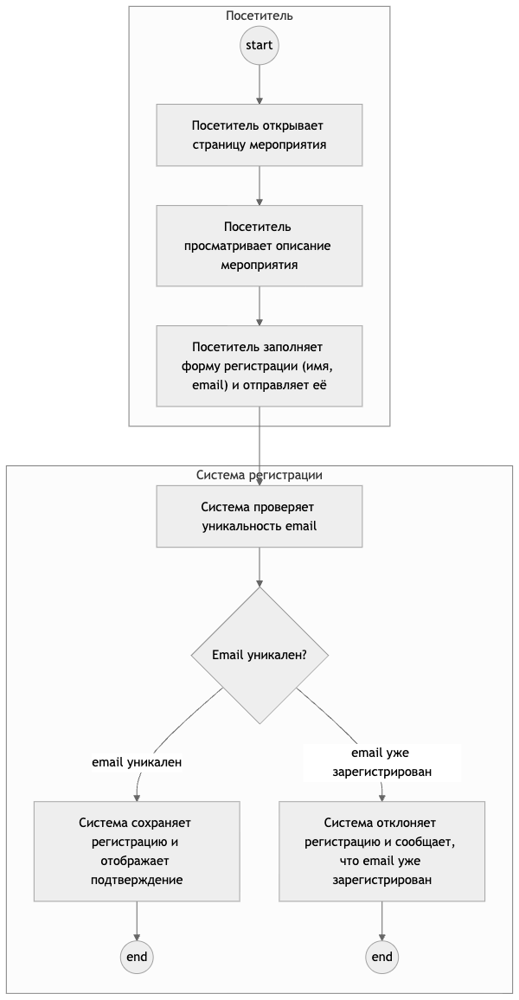

# Генерация трассируемых Use Cases и Activity Diagrams

Система превращает функциональные и нефункциональные требования к приложению в
структурированные варианты использования, пользовательские и системные истории,
Activity Diagrams (диаграммы активности) в Mermaid и отчёт о качестве.

Главное отличие от обычного запроса к LLM — каждый полученный элемент можно
проверить и связать с исходным требованием. Если результат нарушает схему,
структуру диаграммы или правила трассировки, система не скрывает ошибку:
валидаторы отклоняют результат, а ограниченный корректирующий цикл пытается его
исправить.

## Какую задачу решает проект

Статический анализ строит диаграммы по уже существующему коду, но не может
восстановить будущие пользовательские сценарии из бизнес-требований. Прямой
запрос к LLM понимает смысл требований, однако может пропустить требование,
добавить неподтверждённый шаг или вернуть формально некорректный граф.

В этом проекте используются два специализированных агента и корневой
orchestrator (оркестратор):

```text
SpecificationReq (запрос с требованиями)
        ↓
нормализация и присвоение FR/NFR-идентификаторов
        ↓
Use Case Agent (агент вариантов использования)
        ↓
проверка схемы, критика и ограниченное исправление
        ↓
Activity Diagram Agent (агент диаграмм активности)
        ↓
проверка графа, трассировки и Mermaid
        ↓
Use Cases + stories + diagrams + TraceManifest + quality report
```

- `Use Case Agent` формирует акторов, варианты использования, основные и
  альтернативные сценарии, user stories (пользовательские истории) и system
  stories (системные истории).
- `Activity Diagram Agent` строит графы действий по утверждённым сценариям.
- Orchestrator передаёт состояние между агентами, запускает проверки и
  ограничивает количество повторных исправлений.
- Детерминированные валидаторы проверяют схемы, ссылки, достижимость узлов,
  ветвления и происхождение элементов без дополнительного LLM-вызова.

Пример диаграммы, полученной полным pipeline (конвейером):



## Входные данные

CLI (интерфейс командной строки) принимает JSON со следующими полями:

```json
{
  "project_task": "Подготовить аналитические артефакты приложения",
  "project_name": "Event Signup",
  "project_goal": "Автоматизировать регистрацию на мероприятия",
  "project_description": "Сервис публикации мероприятий и регистрации участников",
  "functional_requirements": [
    "Организатор может опубликовать мероприятие с ограничением вместимости",
    "Участник может зарегистрироваться на открытое мероприятие"
  ],
  "non_functional_requirements": [
    "95% запросов регистрации должны обрабатываться не более чем за 2 секунды"
  ]
}
```

Готовый вход для демонстрации находится в
[`examples/event_signup_specification_req.json`](examples/event_signup_specification_req.json).

## Быстрый запуск без API-ключа

Требования к окружению:

- Python 3.11 или новее;
- Poetry (менеджер зависимостей Python);
- Git.

Клонирование и установка:

```bash
git clone https://github.com/ArtemBotsman/agent_langgraph_diagrams.git
cd agent_langgraph_diagrams
poetry install --with evaluation
```

Первый запуск выполняется в режиме `B0_RULE`. Это воспроизводимый
детерминированный ориентир: он не обращается к LLM и позволяет проверить
установку, контракты и сохранение артефактов.

```bash
poetry run traceable-spec \
  examples/event_signup_specification_req.json \
  artifacts/single_runs/event-signup-b0 \
  --mode B0_RULE
```

Каталог результата должен быть новым или пустым. После запуска в нём появятся:

- `input.json` — точная копия входа;
- `generated_specification.json` — полный структурированный результат;
- `use_cases/` — человекочитаемые описания вариантов использования;
- `stories/` — пользовательские и системные истории;
- `activity_diagrams/` — исходники Mermaid;
- `trace_manifest.json` — прямые и обратные связи требований с результатом;
- `validation_reports.json` — результаты формальных проверок;
- `quality_report.md` — сводный отчёт о качестве;
- `run_manifest.json` — режим запуска, версии и контрольные хеши.

## Запуск полного двухагентного pipeline

Скопируйте безопасный пример настроек:

```bash
cp .env.example .env
```

В `.env` укажите провайдера, точный идентификатор модели и API-ключ. Файл
`.env` уже добавлен в `.gitignore` и не должен попадать в Git.

Пример для DeepSeek:

```dotenv
LLM_PROVIDER=deepseek
LLM_API_BASE=https://api.deepseek.com
LLM_MODEL=deepseek-flash
LLM_API_KEY_ENV=DEEPSEEK_API_KEY
DEEPSEEK_API_KEY=ваш_ключ
```

Запуск:

```bash
poetry run traceable-spec \
  examples/event_signup_specification_req.json \
  artifacts/single_runs/event-signup-full \
  --mode FULL \
  --allow-live \
  --env-file .env
```

Флаг `--allow-live` подтверждает, что разрешены сетевые и потенциально платные
LLM-вызовы. Лимиты числа вызовов, токенов, повторов и предполагаемой стоимости
задаются в `.env`. Без этого флага полный сетевой запуск не начинается.

Безопасные конфигурации без ключей находятся в
[`configs/providers/`](configs/providers/). Поддерживаются OpenAI-compatible
API (совместимые с форматом OpenAI) и Anthropic API.

## Проверка реализации

Основной набор автоматических тестов:

```bash
poetry run pytest -q
```

Полный локальный quality gate (контроль качества), не выполняющий платных
запросов:

```bash
poetry check --lock
poetry run ruff check .
poetry run mypy src
poetry run pytest -q
poetry run python scripts/validate_synthetic_benchmark.py
poetry run python scripts/freeze_synthetic_benchmark.py
poetry run python scripts/run_validator_mutation_suite.py --check-existing
```

Те же проверки запускаются в GitHub Actions. API-ключи для них не нужны.

## Воспроизведение эксперимента

Benchmark (тестовый набор) содержит 30 синтетических `SpecificationReq`:
20 development-кейсов и 10 отделённых hidden-кейсов. Входы различаются языком
и сложностью. Gold-разметка задаёт ожидаемых акторов, варианты использования,
смысловые этапы сценариев, ветвления и связи `FR → UC`.

Безопасный повтор B0 на открытой development-части:

```bash
poetry run python scripts/run_benchmark_experiment.py \
  --condition B0_RULE \
  --split development \
  --all-cases \
  --repeats 3 \
  --experiment-id b0-dev20-reproduction
```

Повторная проверка уже сохранённого эксперимента не вызывает LLM:

```bash
poetry run python scripts/verify_saved_experiment.py \
  artifacts/benchmark_runs/b0-dev20-r3-2026-09-09
```

Оценщик разделяет:

- смысловое качество: `Actor F1`, `Use Case F1`, `Milestone F1`, `Branch F1`,
  `Trace F1`;
- формальную корректность: соответствие схемам, структура Activity-графа и
  полнота трассировки;
- надёжность и эффективность: `E2E success`, стабильность повторов, задержка,
  токены и стоимость.

Сохранённые JSON/CSV-результаты и графики находятся в [`artifacts/`](artifacts/).
Методика — в
[`docs/benchmark/BENCHMARK_AND_METRICS_V0_1.md`](docs/benchmark/BENCHMARK_AND_METRICS_V0_1.md),
а сравнение подходов — в
[`docs/research/TECHNOLOGY_PROJECT_COMPARISON_2026_09_11.md`](docs/research/TECHNOLOGY_PROJECT_COMPARISON_2026_09_11.md).

## Структура репозитория

```text
src/traceable_spec/
├── agents/
│   ├── use_case/          # агент вариантов использования
│   └── activity/          # агент диаграмм активности
├── orchestration/         # корневой граф и сохранение состояния
├── validators/            # детерминированные проверки
├── reference_methods/     # B0 и прямой B1 для сравнения
├── evaluation/            # метрики и анализ результатов
├── llm/                   # адаптеры провайдеров
├── mermaid/               # генерация Mermaid
├── entities.py            # Pydantic-модели данных
└── traceability.py        # связи FR → UC → step → diagram

benchmark/                 # 30 размеченных тестовых входов
configs/providers/         # примеры конфигураций без секретов
examples/                  # демонстрационный вход
scripts/                   # запуск и воспроизведение экспериментов
tests/                     # автоматические тесты
artifacts/                 # сохранённые результаты и графики
docs/                      # архитектура, методика и итоговые материалы
```

## Ограничения

- Результат LLM зависит от модели и настроек генерации; поэтому сохраняются
  точные конфигурации, хеши и несколько повторов.
- Формальный `E2E PASS` означает прохождение заявленных валидаторов, но не
  гарантирует идеальное понимание бизнес-смысла. Для итоговой оценки применяется
  также gold-разметка и экспертная рубрика.
- Mermaid используется как проверяемое сценарное представление Activity
  Diagram, а не как полный строгий профиль UML 2.x.
- Hidden-часть нельзя использовать для настройки системы до финального
  зафиксированного эксперимента.

## Материалы технологического проекта

- [Технический отчёт по ГОСТ, PDF](docs/final/deliverables/AgentLangGraph_technology_report_GOST_2026-09-16.pdf)
- [Презентация защиты, PPTX](docs/final/deliverables/AgentLangGraph_NIR_defense_2026-09-16.pptx)
- [Описание архитектуры](docs/architecture/SYSTEM_DESIGN_V0_1.md)
- [Инструкция воспроизводимости](docs/release/REPRODUCIBILITY_AND_DEMO.md)

## Безопасность и лицензия

Секреты хранятся только в локальных `.env`-файлах. В публичных результатах
сохраняются метаданные, токены, стоимость и хеши запросов/ответов, но не API-
ключи. Перед каждым коммитом следует проверять, что `.env` не отслеживается Git.

Исходный код распространяется по [MIT License](LICENSE).
