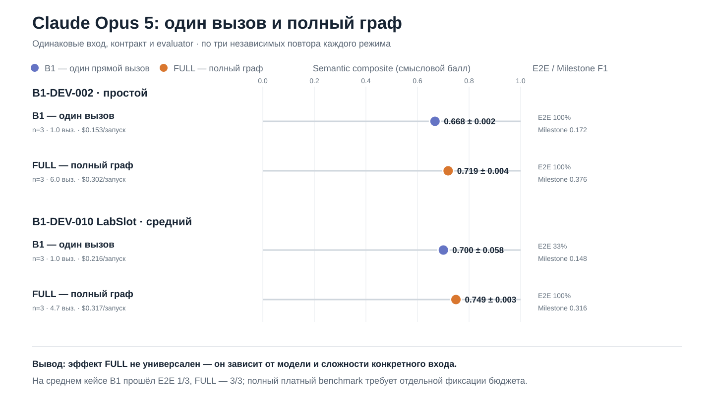

# Claude Opus 5: B1_ONESHOT и FULL

Все значения рассчитаны одним evaluator по сохранённым результатам без ручного исправления ответов.

| Кейс | Сложность | Метод | n | E2E | Semantic | Actor F1 | UC F1 | Milestone F1 | Branch F1 | Trace F1 | Лишние элементы | Токены | Цена | Время |
|---|---|---|---:|---:|---:|---:|---:|---:|---:|---:|---:|---:|---:|---:|
| B1-DEV-002 | simple | B1_ONESHOT | 3 | 100% | 0.668 ± 0.002 | 0.500 | 1.000 | 0.172 | 0.667 | 1.000 | 0.547 | 11232 | $0.153 | 40.6 s |
| B1-DEV-002 | simple | FULL | 3 | 100% | 0.719 ± 0.004 | 0.500 | 1.000 | 0.376 | 0.667 | 1.000 | 0.460 | 33910 | $0.302 | 71.8 s |
| B1-DEV-010 | medium | B1_ONESHOT | 3 | 33% | 0.700 ± 0.058 | 0.756 | 1.000 | 0.148 | 0.667 | 1.000 | 0.511 | 13986 | $0.216 | 60.8 s |
| B1-DEV-010 | medium | FULL | 3 | 100% | 0.749 ± 0.003 | 0.800 | 1.000 | 0.316 | 0.667 | 1.000 | 0.389 | 34289 | $0.317 | 73.9 s |

## Интерпретация

- На простом B1-DEV-002 FULL повысил semantic с 0,668 до 0,719, главным образом за счёт Milestone F1.
- На среднем B1-DEV-010 one-shot прошёл E2E только 1/3, FULL — 3/3; semantic составил 0,700 против 0,749.
- FULL повысил stability с 0,869 до 0,994 и уменьшил proxy лишних элементов с 0,511 до 0,389, но потребовал больше вызовов и токенов.
- Средняя серия завершена. Полный платный benchmark запускается только после предварительной фиксации выборки, бюджета и правила остановки.

