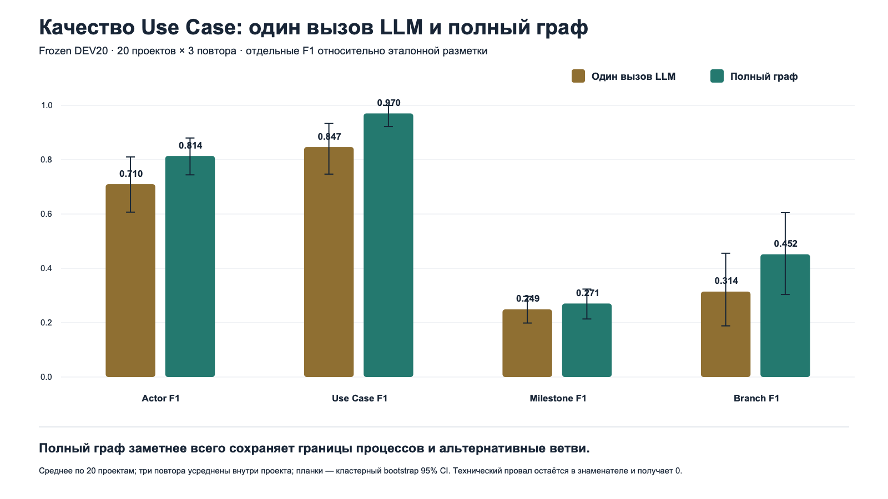
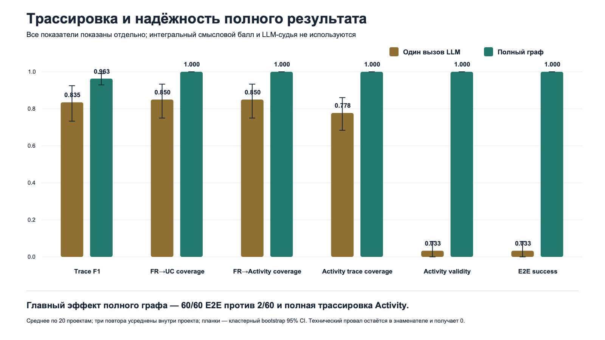

# Результаты объяснимого эксперимента: One-shot против полного графа

## Что считается доказательством

Основной эксперимент сравнивает два способа генерации на одной версии
`DeepSeek deepseek-flash`, одинаковых входах, одной конечной схеме и одном
evaluator:

1. **Один вызов LLM** — модель должна за один ответ вернуть полный комплект артефактов.
2. **Полный граф** — Use Case и Activity формируются специализированными этапами,
   проходят детерминированную проверку, критику и ограниченное исправление.

В основном анализе нет `B0_RULE`, интегрального `Semantic composite` и
LLM-судьи. Смысл сравнивается по отдельным F1 относительно эталонных слотов,
а техническая надёжность — отдельными проверяемыми долями.

## Паспорт DEV20

| Сложность | Проектов | ФТ | Медиана UC | Gold milestones | Gold branches | Gold FR→UC |
|---|---|---|---|---|---|---|
| simple | 6 | 3–3 | 1.0 | 25 | 4 | 18 |
| medium | 9 | 5–6 | 3.0 | 72 | 13 | 47 |
| hard | 5 | 7–8 | 3.0 | 53 | 10 | 40 |

- 20 development-проектов, по 3 повтора на способ: 60 попыток для каждого метода;
- hidden-часть не открывалась;
- эталон — frozen author annotation candidate, а не подтверждённый консенсус
  двух независимых экспертов;
- ошибки формата не исключались: неуспешный task result остаётся в знаменателе.

## Таблица 1. Содержание Use Case

| Метрика | Один вызов | Полный граф | Разница | 95% CI разницы | Holm p |
|---|---|---|---|---|---|
| Actor F1 | 0.710 | 0.814 | +0.104 | [+0.014; +0.206] | 0.1494 |
| Use Case F1 | 0.847 | 0.970 | +0.124 | [+0.018; +0.233] | 0.1494 |
| Milestone F1 | 0.249 | 0.271 | +0.021 | [-0.013; +0.057] | 0.2610 |
| Branch F1 | 0.314 | 0.452 | +0.137 | [+0.025; +0.267] | 0.1221 |

Главный содержательный выигрыш полного графа на этом наборе наблюдается по
`Branch F1`: 0.314 →
0.452. Для `Milestone F1` разница мала:
0.249 → 0.271;
нельзя утверждать, что граф улучшает каждую смысловую метрику.

## Таблица 2. Трассировка, структура и полный запуск

| Метрика | Один вызов | Полный граф | Разница | 95% CI разницы | Holm p |
|---|---|---|---|---|---|
| Trace F1 | 83.5% | 96.3% | +12.8% | [+4.0%; +22.4%] | 0.0889 |
| FR→UC coverage | 85.0% | 100.0% | +15.0% | [+6.7%; +25.0%] | 0.0938 |
| FR→Activity coverage | 85.0% | 100.0% | +15.0% | [+6.7%; +25.0%] | 0.0938 |
| Activity trace coverage | 77.8% | 100.0% | +22.2% | [+14.0%; +31.7%] | <0.0001 |
| Activity validity | 3.3% | 100.0% | +96.7% | [+91.7%; +100.0%] | <0.0001 |
| E2E success | 3.3% | 100.0% | +96.7% | [+91.7%; +100.0%] | <0.0001 |

`FR→Activity coverage` рассчитана отдельно: требование считается дошедшим до
Activity, если существует цепочка `FR → ScenarioStep → ActivityNode/Edge`.
Она не подменяется метрикой доли подписанных элементов диаграммы.

Полный граф завершил и прошёл все обязательные проверки в 60 из 60 попыток;
one-shot — в 2 из 60. Это доказательство технической надёжности, а не
автоматически доказательство идеальной бизнес-семантики.

## Таблица 3. Почему one-shot не прошёл E2E

| Исход попытки | Один вызов LLM | Полный граф |
|---|---|---|
| Полностью успешный запуск | 2 / 60 (3.3%) | 60 / 60 (100.0%) |
| Ответ обрезан по лимиту | 9 / 60 (15.0%) | 0 / 60 (0.0%) |
| Сетевая/транспортная ошибка | 0 / 60 (0.0%) | 0 / 60 (0.0%) |
| Ошибка схемы данных | 0 / 60 (0.0%) | 0 / 60 (0.0%) |
| Некорректная структура Activity | 49 / 60 (81.7%) | 0 / 60 (0.0%) |
| Ошибка сквозной трассировки | 0 / 60 (0.0%) | 0 / 60 (0.0%) |
| Прочий E2E-провал | 0 / 60 (0.0%) | 0 / 60 (0.0%) |

Классы в таблице взаимоисключающие. Сначала учитывается техническая ошибка,
затем ошибка схемы, структуры Activity, трассировки и только потом прочий E2E.
Так один запуск не завышает сразу несколько строк.

## Проверка чувствительности: только разобранные ответы

| Метрика | Один вызов | Полный граф |
|---|---|---|
| Actor F1 | 0.835 (n=51) | 0.814 (n=60) |
| Use Case F1 | 0.996 (n=51) | 0.970 (n=60) |
| Milestone F1 | 0.293 (n=51) | 0.271 (n=60) |
| Branch F1 | 0.370 (n=51) | 0.452 (n=60) |

Эта таблица нужна, чтобы отделить две причины результата. Если смотреть только
на 51 читаемый one-shot-ответ, `Actor/UC/Trace F1` уже высоки. Поэтому основной
эффект графа — гарантированно довести полный комплект до схемы, структуры и
трассировки; содержательный выигрыш наиболее заметен по ветвлениям.

## Операционные показатели — резервный слайд

| Способ | Медиана, с | p95, с | Токенов/проект | Вызовов/проект | Стоимость/проект |
|---|---|---|---|---|---|
| Один вызов LLM | 16.1 | 20.7 | 10,565 | 1.0 | $0.0069 |
| Полный граф | 56.3 | 90.6 | 62,046 | 11.8 | $0.0346 |

Операционные показатели не смешиваются с качеством. Они показывают цену
надёжности: полный граф требует больше вызовов и токенов.

## Предварительный прогон набора руководителя по размеру

| Проект | ФТ | Способ | Исход | Trace F1 | Вызовов | Время, с |
|---|---|---|---|---|---|---|
| SCALE-001 | 6 | Один вызов | E2E успешно | 1.000 | 1 | 38.5 |
| SCALE-001 | 6 | Полный граф | E2E успешно | 1.000 | 18 | 127.9 |
| SCALE-010 | 19 | Один вызов | формальный провал | 0.947 | 1 | 88.4 |
| SCALE-010 | 19 | Полный граф | транспортная ошибка | 0.000 | 45 | 243.7 |
| SCALE-015 | 48 | Один вызов | ответ обрезан | 0.000 | 1 | 161.2 |
| SCALE-015 | 48 | Полный граф | артефакты созданы; финальная проверка не пройдена | 1.000 | 127 | 595.7 |
| SCALE-020 | 74 | Один вызов | ответ обрезан | 0.000 | 1 | 160.6 |
| SCALE-020 | 74 | Полный граф | артефакты созданы; финальная проверка не пройдена | 0.986 | 181 | 780.0 |

Это диагностический preflight по одному проекту из каждой размерной группы, а
не финальный эксперимент по 20 проектам. На 48 и 74 ФТ one-shot упёрся в лимит
длины ответа. Полный граф сформировал структурированные артефакты, но финальный
gate выявил несогласованные ссылки и структурные дефекты. Следовательно,
пакетная декомпозиция масштабируется лучше монолитного ответа по объёму, но
текущая версия ещё не доказала требуемую E2E-надёжность на больших входах.

Научно корректный следующий шаг: две независимые проверки Gold для этих 20
проектов, freeze, исправление общих классов контрактных ошибок на development,
затем одинаковые повторные запуски One-shot и Full по четырём группам.

## Что вынести на основные слайды

1. График `dev20_content_f1.png` — четыре раздельные F1 без общего балла.
2. График `dev20_trace_reliability.png` — трассировка, структура и E2E.
3. Короткий анализ ошибок: 9 обрезанных one-shot-ответов, 49 структурных
   провалов среди остальных и 60/60 успешных полных запусков.
4. Один честный вывод: **полный граф резко повышает техническую принимаемость и
   сохранение ветвлений, но стоит дороже; улучшение каждого смыслового аспекта
   на DEV20 не подтверждено**.

## Воспроизводимость

- benchmark SHA-256: `af8dc532d4d283db43687850213e5795ca227c0d6d054327727462e0ab170917`;
- one-shot results SHA-256: `02d90c7247701e5a841e1d7952e0af0fbb517161cd6723ae4099b6b6b26b5954`;
- full results SHA-256: `0ddc936dd2148d871bd422254c985a1476856a90ebf860023f6541a87d8a7983`;
- bootstrap: 50000 выборок, seed
  `20260915`;
- скрипт: `scripts/build_explainable_experiment_results.py`;
- машинные таблицы: `artifacts/explainable_experiment_results_2026-09-15/`.
