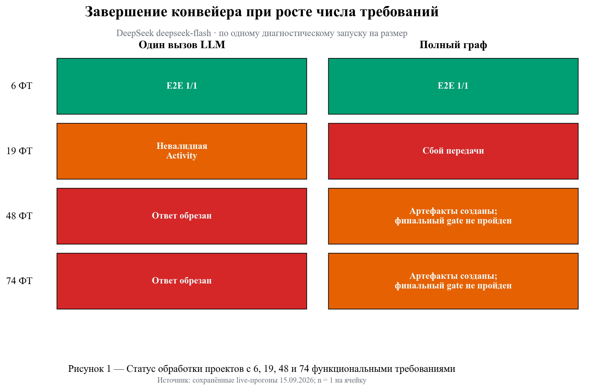
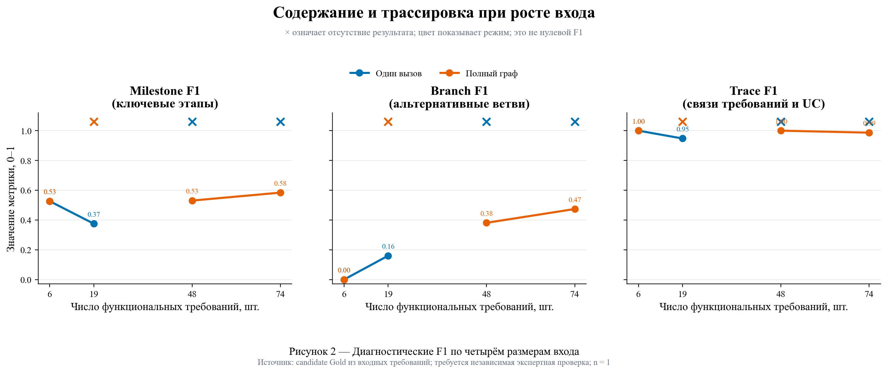
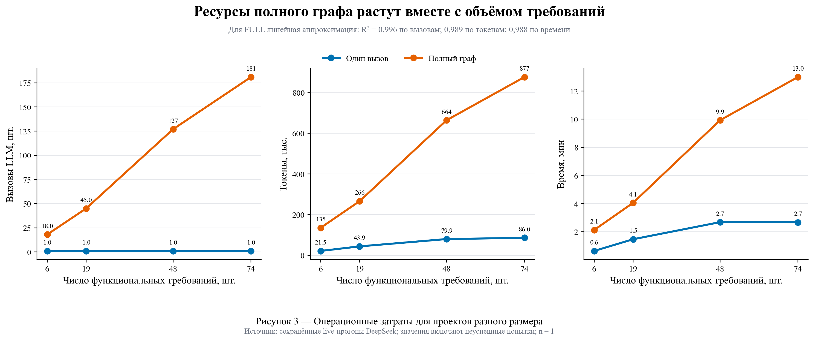
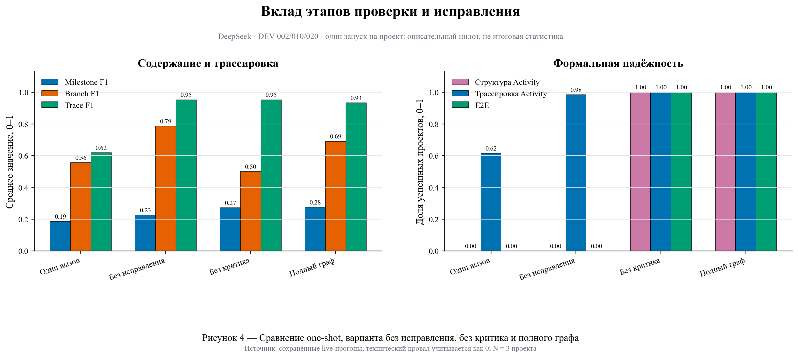
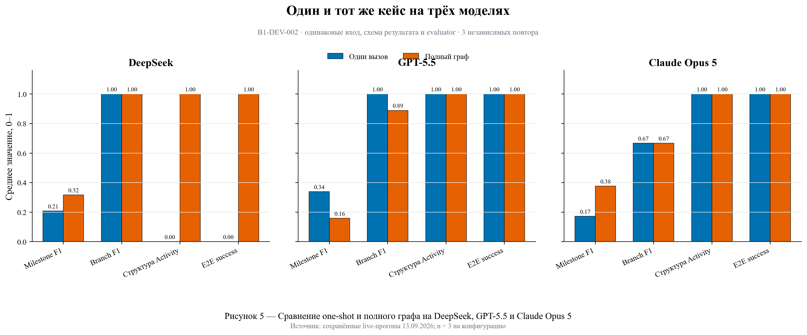
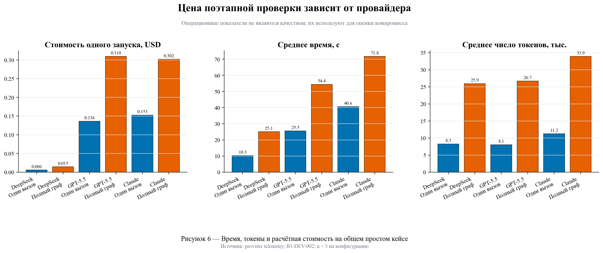

# Эксперименты: масштабирование, вклад компонентов и переносимость между моделями

Дата сборки: 2026-09-16. Все числа восстановлены из сохранённых live-прогонов; новых платных вызовов скрипт не выполняет.

## Короткий итог

1. На frozen DEV20 полный граф DeepSeek дал 60/60 E2E против 2/60 у одного вызова. Наиболее доказанный эффект — формальная надёжность и трассировка, а не универсальный рост каждого содержательного F1.
2. В размерном preflight один вызов прошёл при 6 ФТ, получил невалидную Activity при 19 ФТ и был обрезан при 48/74 ФТ. FULL создал большие комплекты при 48/74 ФТ, но финальный E2E gate ещё не прошёл.
3. В компонентном пилоте вариант без исправления дал 0/3 E2E, а варианты с исправлением — 3/3. Отдельный вклад критика пока статистически не доказан: без критика тоже 3/3, хотя Branch F1 ниже.
4. На общем простом кейсе FULL исправляет формальный провал DeepSeek, улучшает Milestone F1 Claude, но не улучшает GPT-5.5. Эффект архитектуры зависит от модели и сложности входа.

## Что означает каждая метрика

Все метрики качества находятся в диапазоне 0–1: `1` — полное совпадение с проверенным эталоном по данному аспекту, `0` — совпадений нет. `Precision = TP / (TP + FP)`, `Recall = TP / (TP + FN)`, `F1 = 2PR / (P + R)`. Здесь TP — подтверждённое совпадение, FP — лишний неподтверждённый элемент, FN — пропущенный ожидаемый элемент.

- **Actor F1** — совпадение ролей процесса с эталоном. Низкое значение означает пропущенных либо лишних участников.
- **UC F1** — совпадение набора Use Cases и их границ. Штрафует пропуск процесса, лишний процесс, ошибочное объединение или дробление.
- **Milestone F1** — совпадение обязательных ключевых этапов сценария. Учитывает и пропуски, и лишнюю детализацию.
- **Branch F1** — совпадение условий и результатов альтернативных/ошибочных путей.
- **Trace F1** — правильность конкретных связей `FR → UC`: Precision штрафует лишние связи, Recall — потерянные.
- **FR → Activity coverage** — доля функциональных требований, которые дошли через шаг Use Case хотя бы до одного узла или ребра Activity.
- **Activity structural validity** — доля диаграмм, прошедших детерминированные инварианты: начало/конец, достижимость, допустимые переходы, ветвления и уникальные ID.
- **E2E success** — бинарный результат проекта: все обязательные артефакты созданы и одновременно прошли схемы, структуру и трассировку.
- **Latency, tokens, cost** — операционные показатели цены результата; они не заменяют метрики качества.

## 1. Масштабирование: 6, 19, 48 и 74 ФТ

| ФТ | Один вызов | FULL | Milestone F1: one-shot / FULL | Branch F1: one-shot / FULL | Trace F1: one-shot / FULL |
|---:|---|---|---:|---:|---:|
| 6 | E2E пройден | E2E пройден | 0.526 / 0.526 | 0.000 / 0.000 | 1.000 / 1.000 |
| 19 | Артефакты созданы; финальная проверка не пройдена | Сбой API | 0.375 / — | 0.160 / — | 0.947 / — |
| 48 | Ответ обрезан | Артефакты созданы; финальная проверка не пройдена | — / 0.530 | — / 0.381 | — / 1.000 |
| 74 | Ответ обрезан | Артефакты созданы; финальная проверка не пройдена | — / 0.584 | — / 0.474 | — / 0.986 |

**Что показывают рисунки 1–3.** Рисунок 1 отвечает только на вопрос завершения. Рисунок 2 показывает содержательные F1 там, где результат вообще удалось получить; крест — отсутствие результата, его цвет показывает режим, и это не значение 0. Рисунок 3 показывает цену масштабирования: для FULL число вызовов, токены и время в этом четырёхточечном пилоте растут почти линейно с числом ФТ (`R² = 0,996 / 0,989 / 0,988`). Это свидетельство предсказуемого роста затрат, но не доказательство качества.

**Ограничение.** Здесь по одному проекту и одному запуску на размер, а Gold пока является candidate-разметкой, построенной только из входных требований. Эти данные пригодны как инженерный preflight; финальный вывод по качеству требует независимой проверки Gold и повторов.

## 2. Анализ вклада компонентов

| Конфигурация | Milestone F1 | Branch F1 | Trace F1 | Activity valid | E2E | Вызовы | Токены |
|---|---:|---:|---:|---:|---:|---:|---:|
| Один вызов | 0.185 | 0.556 | 0.619 | 0% | 0% | 1.0 | 10358 |
| Без исправления | 0.226 | 0.786 | 0.952 | 0% | 0% | 1.7 | 9380 |
| Без критика | 0.272 | 0.500 | 0.952 | 100% | 100% | 6.3 | 37011 |
| Полный граф | 0.276 | 0.690 | 0.933 | 100% | 100% | 10.3 | 52947 |

Главный наблюдаемый эффект — необходимость ограниченного исправления: без него формальные дефекты остаются и E2E равен 0/3. Вариант без критика прошёл 3/3, как и FULL, поэтому утверждать, что критик сам по себе повышает E2E, нельзя. В этом пилоте критик связан с ростом Branch F1 с 0,500 до 0,690, но N = 3 и один повтор не позволяют считать различие доказанным.

## 3. DeepSeek, GPT-5.5 и Claude Opus 5

Общий кейс: `B1-DEV-002`; три независимых повтора каждого режима; одинаковые вход, целевая схема и evaluator.

| Модель | Режим | Actor F1 | UC F1 | Milestone F1 | Branch F1 | Trace F1 | Activity valid | E2E | Цена/запуск |
|---|---|---:|---:|---:|---:|---:|---:|---:|---:|
| DeepSeek | Один вызов | 0.611 | 1.000 | 0.207 | 1.000 | 1.000 | 0% | 0% | $0.006 |
| DeepSeek | Полный граф | 0.500 | 1.000 | 0.316 | 1.000 | 1.000 | 100% | 100% | $0.015 |
| GPT-5.5 | Один вызов | 0.500 | 1.000 | 0.338 | 1.000 | 1.000 | 100% | 100% | $0.136 |
| GPT-5.5 | Полный граф | 0.500 | 1.000 | 0.159 | 0.889 | 1.000 | 100% | 100% | $0.310 |
| Claude Opus 5 | Один вызов | 0.500 | 1.000 | 0.172 | 0.667 | 1.000 | 100% | 100% | $0.153 |
| Claude Opus 5 | Полный граф | 0.500 | 1.000 | 0.376 | 0.667 | 1.000 | 100% | 100% | $0.302 |

**Интерпретация.** Полный граф не обязан повышать каждый F1 у уже сильной модели на простом кейсе. Его техническая ценность — контролируемая декомпозиция, явные связи, детерминированные gates и исправление конкретных дефектов. На DeepSeek это изменило E2E с 0/3 на 3/3; у GPT-5.5 оба режима дали 3/3, а Milestone F1 one-shot оказался выше; у Claude FULL повысил Milestone F1. Поэтому сильное заявление должно быть: граф повышает надёжность слабее контролируемых ответов и предоставляет проверяемую трассировку, но его содержательное преимущество зависит от модели и входа.

## 4. Что ещё сравнивать

1. **Основное доказательство:** one-shot и FULL одной модели на frozen DEV20 — уже выполнено для DeepSeek ×3.
2. **Масштабирование:** после экспертной проверки candidate Gold выполнить одинаковые one-shot/FULL ×3 во всех четырёх группах. До этого не тратить бюджет на полный запуск.
3. **Экспертная принимаемость:** два независимых эксперта вслепую оценивают полноту, корректность и читаемость; это нельзя заменить выдуманными числами или LLM-судьёй.
4. **Валидаторы:** mutation-suite уже проверяет заранее внесённые структурные дефекты; это отдельное доказательство, что formal gates обнаруживают заявленные классы ошибок.
5. **Pyreverse, GitDiagram, DeepWiki:** оставить в обзоре аналогов как системы с другим входом (`код/репозиторий → диаграмма`). Они не являются честным количественным baseline для задачи `требования → сценарии → Activity до кода`.

### Как показать результаты на защите

- На основной слайд: рисунок 4 (вклад компонентов) и одна крупная цифра `E2E: 0/3 без исправления → 3/3 с исправлением`.
- Следующий слайд: рисунок 5 (три модели), чтобы показать переносимость и отсутствие заранее заданного победителя.
- В резерв: рисунок 1 как матрицу завершения по 6/19/48/74 ФТ и рисунок 3 как цену масштабирования.
- Рисунок 2 пока помечать как диагностический: размерный Gold ещё требует независимой экспертной проверки.

## 5. Промпт и воспроизведение Claude

- Полная инструкция и неизменяемый prompt: `experiments/claude_opus_5_dev20/00_CLAUDE_OPUS_5_RUNBOOK_AND_PROMPT_RU.md`.
- Запуск собственного pipeline: `scripts/run_benchmark_experiment.py`.
- Импорт и оценка внешних ответов Claude: `scripts/evaluate_external_model_outputs.py`.
- Все три модели уже имеют реальные сохранённые one-shot и FULL прогоны на общем кейсе; повторный платный запуск этого же кейса не добавит нового доказательства.

## 6. Методологическое основание

- Zhang et al. (2026), *Large language models in model-driven engineering: a systematic mapping study*: рекомендуются явные baseline, версии моделей, prompts, логи, стоимость, воспроизводимость и artifact-sensitive criteria — полнота, согласованность, корректность, трассируемость и взаимодействие.
- Ferrari, Abualhaija, Arora (2024): диаграммы из требований могут быть понятными и синтаксически корректными, но часто страдают по полноте и корректности, особенно при неоднозначных требованиях.
- Giannouris, Ananiadou (2025), NOMAD: разделение генерации UML между специализированными агентами полезно для интерпретируемости и адресной проверки, но эффект verification может быть неоднозначным — поэтому компоненты нужно измерять отдельно.
- Query2Diagram (2026): отделяет структурированное JSON-представление от рендера и оценивает структурные дефекты отдельно от смысловой релевантности; это поддерживает наш принцип typed model → validator → Mermaid, но задача статьи начинается с кода и запроса разработчика.

## Файлы-источники

- `artifacts/benchmark_runs/b1-dev20-r3-deepseek-flash-2026-09-13/results.json`
- `artifacts/benchmark_runs/full-dev20-r3-deepseek-flash-2026-09-13/results.json`
- `artifacts/benchmark_runs/component-comparison-dev3-deepseek-flash-2026-09-11/results.csv`
- `artifacts/benchmark_runs/full-critic-v2-dev3-deepseek-flash-2026-09-11/results.csv`
- `artifacts/three_model_generator_comparison_2026-09-13/`
- `artifacts/claude_b1_full_pilot_2026-09-13/`
- `artifacts/size_scaling_runs/size-scaling-gold-preflight-*`
