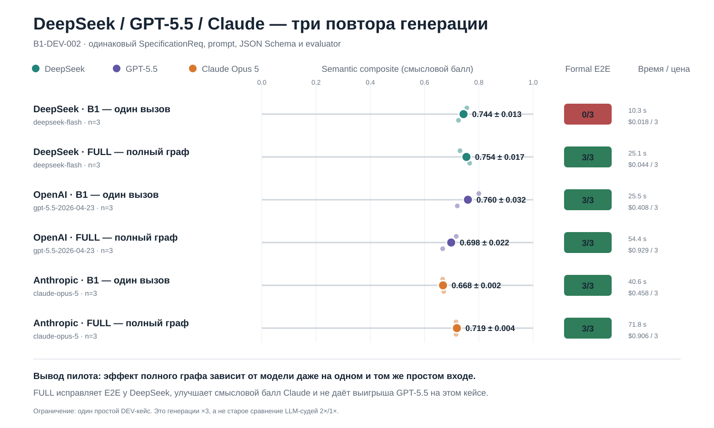

# Сравнение DeepSeek, GPT-5.5 и Claude Opus 5

Все строки относятся к одному простому кейсу `B1-DEV-002`. Для каждой показанной конфигурации выполнено ровно три независимых запуска.

| Модель и режим | Повторы | Formal E2E | Semantic, mean ± SD | Stability | Среднее время | Токены, всего | Цена, всего |
|---|---:|---:|---:|---:|---:|---:|---:|
| DeepSeek deepseek-flash · B1_ONESHOT | 3 | 0/3 | 0.744 ± 0.013 | 0.969 | 10.3 s | 24,809 | $0.018 |
| DeepSeek deepseek-flash · FULL | 3 | 3/3 | 0.754 ± 0.017 | 0.965 | 25.1 s | 77,830 | $0.044 |
| OpenAI gpt-5.5-2026-04-23 · B1_ONESHOT | 3 | 3/3 | 0.760 ± 0.032 | 0.920 | 25.5 s | 24,193 | $0.408 |
| OpenAI gpt-5.5-2026-04-23 · FULL | 3 | 3/3 | 0.698 ± 0.022 | 0.950 | 54.4 s | 80,134 | $0.929 |
| Anthropic claude-opus-5 · B1_ONESHOT | 3 | 3/3 | 0.668 ± 0.002 | 0.996 | 40.6 s | 33,696 | $0.458 |
| Anthropic claude-opus-5 · FULL | 3 | 3/3 | 0.719 ± 0.004 | 0.991 | 71.8 s | 101,731 | $0.906 |

## Как читать результат

- `B1_ONESHOT` (один прямой вызов): одна модель сразу формирует весь комплект артефактов.
- `FULL` (полный граф): два агентных подграфа, детерминированные проверки и ограниченное исправление.
- `Formal E2E` (формальное сквозное прохождение): схема, структура Activity, Mermaid и трассировка одновременно прошли обязательные проверки.
- `Semantic` (смысловой балл): соответствие gold-разметке по акторам, UC, этапам сценария, ветвлениям и трассировке.
- `Stability` (устойчивость): сходство трёх повторов между собой; ближе к 1 — меньше разброс.

## Вывод

На этом простом кейсе GPT-5.5 B1 имеет наибольший средний смысловой балл и проходит E2E 3/3. Claude проходит 3/3 в обоих режимах, а FULL повышает его смысловой балл с 0,668 до 0,719 главным образом за счёт более полного сценария. DeepSeek B1 получает близкий смысловой балл, но не проходит формальный gate; FULL устраняет дефекты и даёт 3/3. Для GPT-5.5 FULL не дал выигрыша качества на простом входе, зато потребовал больше вызовов, токенов и времени. Это аргумент исследовать зависимость пользы графа от модели и сложности проекта, а не утверждение, что один метод всегда лучше.

## Почему старый рисунок показывал 2 и 1

Старый рисунок `29_deepseek_gpt55_judge_comparison` относится к другому эксперименту: один сохранённый результат оценивали два раза DeepSeek и один раз GPT-5.5 как LLM-судьи. Он не измерял три независимые генерации. Новый рисунок ниже относится именно к генерациям и показывает `n=3` у каждой строки.

## Ограничение

Descriptive pilot on one simple DEV case, not final statistical evidence. The result motivates the next preregistered comparison on a medium DEV case.

