# System Design v0.1

Дата: **2026-08-21**, входной контракт уточнён **2026-09-08**, исполняемая
архитектура актуализирована **2026-09-09**.

## 1. Цель архитектуры

Управляемый **agentic workflow** (не рой автономных агентов) на LangGraph Graph API:

- LLM-generator / LLM-critic / LLM-repair — реальные узлы через `LLMClient`
  Protocol; stub-реализации оставлены только для быстрых offline-тестов;
- deterministic validators — обычные Python-функции;
- repair — цикл с явным `repair_attempt` и `max_repair_attempts`;
- Mermaid renderer — чистая функция без LLM.

## 2. Схема архитектуры

```mermaid
flowchart TB
  subgraph Input
    SR[SpecificationReq — raw TypedDict]
  end

  subgraph Pipeline["orchestration/pipeline.py — root pipeline"]
    N[normalize_requirements → SpecificationRequest]
    UC[Use Cases subgraph]
    AD[Activity subgraph per UC]
    T[e2e trace validation]
    E[evaluator]
    OUT[GeneratedSpecification]
  end

  subgraph UCGraph["agents/use_case/graph.py"]
    U1[prepare_requirements]
    U2[generate_use_case_set LLM]
    U3[validate_uc_schema]
    U4[validate_uc_deterministic]
    U5[criticize_use_case_set LLM]
    U6[decide_uc_result]
    U7[repair_use_case_set LLM]
    U8[finalize_use_case_set]
    U9[fail_use_case_generation]
    U1 --> U2 --> U3 --> U4
    U4 -->|formal ok| U5 --> U6
    U4 -->|formal fail: skip critic| U6
    U6 -->|ok| U8
    U6 -->|attempt < max| U7 --> U3
    U6 -->|exhausted| U9
  end

  subgraph ADGraph["agents/activity/graph.py"]
    A1[prepare_use_case]
    A2[generate_activity_model LLM]
    A3[validate_activity_schema]
    A4[validate_activity_deterministic]
    A5[criticize_activity_model LLM]
    A6[decide_activity_result]
    A7[repair_activity_model LLM]
    A8[render_mermaid deterministic]
    A9[finalize_activity]
    A10[fail_activity_generation]
    A1 --> A2 --> A3 --> A4
    A4 -->|formal ok| A5 --> A6
    A4 -->|formal fail: skip critic| A6
    A6 -->|ok| A8 --> A9
    A6 -->|attempt < max| A7 --> A3
    A6 -->|exhausted| A10
  end

  SR --> N --> UC
  UC --> UCGraph
  UC --> AD --> ADGraph
  AD --> T --> E --> OUT
```

## 3. Решения и альтернативы

### 3.1. LangGraph Graph API vs «свободные» агенты

| | Выбранный вариант | Альтернативы |
|--|-------------------|--------------|
| Выбор | `StateGraph` + conditional edges + subgraphs | Autogen-style multi-agent; чистый imperative Python |
| Плюсы | Явный control flow, компиляция графа, тестируемые stub-узлы | — |
| Минусы | Больше boilerplate | Multi-agent сложнее валидировать и ограничивать repair |
| Почему для трассировки | Артефакты в типизированном State, а не только в `messages` | |

### 3.2. TypedDict State + Pydantic contracts

| | Выбранный вариант | Альтернативы |
|--|-------------------|--------------|
| Выбор | TypedDict для внешнего `SpecificationReq` и State; Pydantic v2 для нормализованного I/O и домена; `extra="forbid"` | Весь State на Pydantic; только dict |
| Плюсы | Рекомендация LangGraph по производительности State; жёсткие контракты на границах | — |
| Минусы | Два слоя типов | Pydantic-State медленнее и тяжелее для reducers |
| Почему | Значимые артефакты (`use_case_set`, `trace_manifest`, …) явны и сериализуемы | |

Внешний `SpecificationReq` содержит исходный `project_task` и списки строк
FR/NFR. Первый root-узел присваивает им стабильные `FR-###` / `NFR-###` и
создаёт внутренний `SpecificationRequest`.

### 3.3. Единый TraceManifest

См. `TRACEABILITY_MODEL.md`. Не дублируем двунаправленные поля на сущностях.

### 3.4. Dependency injection LLM

`LLMClient` Protocol + подмена узлов через `UseCaseNodeFns` / `ActivityNodeFns` / `PipelineDeps`. Нет зашитых URL/моделей.

### 3.5. Последовательная генерация activity по UC

Сейчас — цикл в корневом графе. Параллельный map — следующий инкремент (контракт уже per-UC).

## 4. Семантика User Story и System Story

- **User Story (user story)** — потребность актора: роль / capability / benefit. Не шаг сценария.
- **System Story (system story)** — ответственность системы, реализующая часть UC. Не шаг сценария.
- **ScenarioStep** — упорядоченный шаг main/alt/exception сценария UC.

Связи UC↔US/SS только через `TraceManifest` (и дублирующие foreign keys `use_case_id` для удобства валидации).

## 5. Слои валидации (не смешивать)

1. Schema — Pydantic.
2. Structural — граф сценария/activity.
3. Trace — целостность и покрытие.
4. Semantic LLM criticism — реализована; её вывод не заменяет формальные
   валидаторы или экспертную оценку.
5. Experimental metrics — evaluator (отдельно от judge/эксперта).

## 6. Модули

См. `README.md`. Основная реализация находится в `entities.py`,
`agents/use_case/graph.py`, `agents/activity/graph.py` и
`orchestration/pipeline.py`. Старые корневые имена оставлены только как слой
совместимости импортов.
