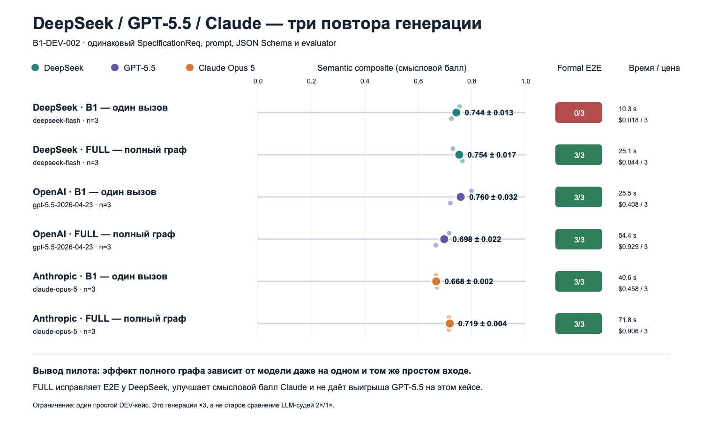

# DeepSeek, GPT-5.5 и Claude: три повтора генерации

## Что проверяется

Один и тот же `SpecificationReq` (структурированный вход проекта)
`B1-DEV-002` передаётся каждой модели с одним и тем же программным prompt
(инструкцией) и одной JSON Schema (схемой результата). Для каждой модели
выполняются три независимых повтора.

Этот этап сравнивает модели в режиме `B1_ONESHOT` (один прямой вызов без
критика и исправления). Он не заменяет сравнение `B1_ONESHOT` с `FULL`
(полным двухагентным конвейером).



## Единая таблица результатов

Все строки ниже относятся к одному и тому же простому кейсу `B1-DEV-002`.
В каждой строке выполнено ровно три независимых запуска.

| Модель и режим | Повторы | Formal E2E | Semantic, среднее ± SD | Stability | Среднее время | Токены, всего | Цена, всего |
|---|---:|---:|---:|---:|---:|---:|---:|
| DeepSeek `deepseek-flash`, `B1_ONESHOT` | 3 | 0/3 | 0,744 ± 0,013 | 0,969 | 10,3 с | 24 809 | $0,018 |
| DeepSeek `deepseek-flash`, `FULL` | 3 | 3/3 | 0,754 ± 0,017 | 0,965 | 25,1 с | 77 830 | $0,044 |
| OpenAI `gpt-5.5-2026-04-23`, `B1_ONESHOT` | 3 | 3/3 | 0,760 ± 0,032 | 0,920 | 25,5 с | 24 193 | $0,408 |
| OpenAI `gpt-5.5-2026-04-23`, `FULL` | 3 | 3/3 | 0,698 ± 0,022 | 0,950 | 54,4 с | 80 134 | $0,929 |
| Anthropic `claude-opus-5`, `B1_ONESHOT` | 3 | 3/3 | 0,668 ± 0,002 | 0,996 | 40,6 с | 33 696 | $0,458 |
| Anthropic `claude-opus-5`, `FULL` | 3 | 3/3 | 0,719 ± 0,004 | 0,991 | 71,8 с | 101 731 | $0,906 |

`Semantic` (смысловой балл) и `Formal E2E` (формальное сквозное прохождение)
нужно читать вместе. Например, DeepSeek B1 получает содержательно сильный
результат, но трижды нарушает обязательный контракт Activity/trace, поэтому
формально не принимается. Полный граф исправляет этот класс ошибок и проходит
3/3.

## Что означает Stability

`Stability` (устойчивость) показывает, насколько похожи три повтора одной
конфигурации между собой. `1,0` означает практически одинаковое содержание,
меньшее значение — больший разброс. Это **не** показатель правильности:
система может три раза стабильно повторить одну и ту же ошибку.

- Claude B1: `0,996` — самый малый разброс;
- Claude FULL: `0,991`;
- DeepSeek B1: `0,969`;
- DeepSeek FULL: `0,965`;
- GPT-5.5 FULL: `0,950`;
- GPT-5.5 B1: `0,920` — самый большой разброс из пяти строк, но всё ещё
  достаточно высокое сходство.

## Что означает Claude Semantic = 0,668

Это не вероятность и не утверждение «диаграмма правильна на 66,8%».
`semantic_composite` — вспомогательная взвешенная метрика соответствия
синтетической gold-разметке:

`0,15 × Actor F1 + 0,25 × UC F1 + 0,25 × Milestone F1 + 0,15 × Branch F1 + 0,20 × Trace F1`.

Для Claude на этом кейсе средние составляющие были:

- Actor F1 = `0,500`;
- UC F1 = `1,000`;
- Milestone F1 = `0,172`;
- Branch F1 = `0,667`;
- Trace F1 = `1,000`.

Именно слабое совпадение формулировок/декомпозиции сценарных milestones
(этапов) снизило итоговый балл. При этом Claude полностью совпал по набору UC и
трассировке и прошёл Formal E2E 3/3. Более сильная модель может предложить
корректные дополнительные шаги или иначе разделить процесс, которые узкая
автоматическая gold-разметка сочтёт лишними. Поэтому этот score используется
как candidate metric (кандидатная метрика) вместе с размерным benchmark и
двумя независимыми экспертами, а не как абсолютный рейтинг моделей.

## Почему DeepSeek B1 получил Formal E2E 0/3

Это не означает, что три запуска не состоялись. Все три ответа были получены и
содержательно разобраны. Каждый ответ сохранил Use Cases и корректные ссылки
ФТ → UC, но оставил часть переходов Activity Diagram без источника в шагах UC:

- repeat 1: три `activity_edge_untraced`, покрытие элементов `0,880`;
- repeat 2: два `activity_edge_untraced`, покрытие `0,920`;
- repeat 3: два `activity_edge_untraced`, покрытие `0,931`.

Для Activity принят заранее заявленный порог `1,00`: каждый узел и каждое ребро
должны иметь источник в UC либо явную маркировку `unsupported`. Поэтому
validator зафиксировал два класса блокирующих дефектов:
`activity_edge_untraced` и `activity_trace_coverage_below_threshold`.
Невалидная Activity не передаётся в Mermaid как принятый результат, поэтому
Formal E2E = `0/3`.

Исправлять сохранённый B1 задним числом нельзя: B1 специально определён как
один прямой вызов без исправляющего контура. Если добавить validator-guided
repair (исправление по отчёту валидатора), получится уже `FULL`. На том же
кейсе DeepSeek FULL исправил эти дефекты и прошёл 3/3 — это и есть измеряемая
польза полного графа.

## Что подразумевается под FULL

`FULL` (полный граф) — не «более длинный prompt», а управляемый LangGraph
pipeline:

1. нормализация и атомизация ФТ/НФТ;
2. Use Case Agent: generator → schema validation → deterministic validation →
   critic → accept либо bounded repair;
3. Activity Agent для каждого UC: generator → schema/structure/trace validation
   → critic → accept либо bounded repair;
4. детерминированная генерация Mermaid;
5. сбор двустороннего `TraceManifest`;
6. итоговая E2E-проверка, метрики, quality report и checkpoint.

В системе два агентных подграфа: Use Case Agent и Activity Agent. Root
orchestrator управляет порядком и состоянием, но не является третьим агентом.
Критик и repair — внутренние роли каждого подграфа. Число LLM-вызовов зависит
от количества UC и найденных дефектов; цикл исправления всегда ограничен.

## Зачем был запущен Claude FULL

Он нужен для симметричного исследования вклада архитектуры при одной и той же
базовой модели: `Claude B1` против `Claude FULL`. Выполнена безопасная
последовательность:

1. один Claude FULL compatibility run на `B1-DEV-002` с checkpoint и cost guard;
2. если он штатно завершён — ещё два повтора;
3. тот же evaluator и сравнение B1/FULL;
4. затем один заранее выбранный средний проект, потому что простой кейс уже не
   даёт достаточно информации о пользе графа;
5. после оценки цены полного и среднего пилота полный размерный benchmark пока
   не запускается: сначала нужно повторить средний кейс.

## Что уже измерено

### DeepSeek B1 × 3

- formal E2E (сквозное прохождение формальных проверок): 0/3;
- semantic composite (кандидатная смысловая метрика): около 0,7435;
- ответы разобраны, но итоговый формальный контракт не выполнен.

### DeepSeek FULL × 3

- formal E2E: 3/3;
- semantic composite: около 0,7541;
- исправляющий контур обеспечил принимаемую структуру и трассировку.

### GPT-5.5 B1 × 3

- exact model (точная версия): `gpt-5.5-2026-04-23`;
- formal E2E: 3/3;
- schema, FR coverage, trace, Activity и Mermaid: 100%;
- semantic composite: `0,7596 ± 0,0325`;
- stability (устойчивость повторов): `0,9205`;
- средняя задержка одного вызова: `25,54 s`;
- три запроса заняли около 28 секунд wall-clock (общего времени), потому что
  выполнялись параллельно;
- всего 24 193 токена;
- расчётная стоимость трёх вызовов: `$0,408315`.

Вывод пока ограничен одним простым development case (кейсом разработки).
Нельзя утверждать, что GPT-5.5 в целом лучше DeepSeek на всех проектах.

### GPT-5.5 FULL × 3

- formal E2E: 3/3;
- semantic composite: `0,6980 ± 0,0223`;
- stability: `0,9500`;
- средняя задержка полного pipeline (конвейера): `54,42 s`;
- в среднем `6,33` LLM-вызова и `26 711` токенов;
- всего `80 134` токена;
- расчётная стоимость трёх прогонов: `$0,929220`;
- в одном повторе исходный структурный дефект был исправлен за один
  repair step (шаг исправления), итоговый E2E прошёл.

На этом маленьком кейсе GPT one-shot получил semantic `0,7596`, а FULL —
`0,6980`; оба варианта прошли E2E 3/3. Следовательно, на простой задаче сильная
модель может выполнить контракт одним вызовом, а дополнительные агентные шаги
увеличивают стоимость и время без выигрыша кандидатной смысловой метрики.
Это отрицательный, но полезный результат. Он не отменяет граф: на DeepSeek тот
же B1 провалил E2E 3/3, тогда как FULL прошёл 3/3. Вклад графа зависит от
сложности входа и способности базовой модели, поэтому следующий вывод должен
проверяться на средних и больших проектах.

### Claude Opus 5 B1 × 3

- exact model (точная модель): `claude-opus-5`;
- formal E2E: 3/3;
- semantic composite: `0,6679 ± 0,0018`;
- stability: `0,9962` — наименьший разброс из трёх direct-model
  (прямых модельных) вариантов;
- средняя задержка: `40,63 s`;
- всего `33 696` токенов;
- расчётная стоимость трёх вызовов: `$0,458220`;
- все ответы закончились штатно (`end_turn`) и не были обрезаны;
- для Opus 5 параметр `temperature=0` не отправляется, потому что модель
  использует adaptive thinking (адаптивное рассуждение) и принимает только
  температуру по умолчанию. Фактическая настройка записана в metadata
  (метаданных) каждого запуска.

### Claude Opus 5 FULL × 3

- formal E2E: 3/3;
- semantic composite: `0,7189 ± 0,0043`;
- stability: `0,9909`;
- Milestone F1 вырос с `0,1717` в B1 до `0,3758`;
- Trace F1: `1,000`;
- средняя задержка: `71,77 s`;
- в среднем 6 LLM-вызовов и 33 910 токенов;
- всего 101 731 токен;
- расчётная стоимость трёх прогонов: `$0,906455`;
- все три прогона прошли без repair, то есть измеряемый выигрыш связан со
  staged generation (поэтапной генерацией), а не с исправлением аварии.

Подробное объяснение gold и завершённая средняя серия n=3 находятся в
[[31_GOLD_РАЗМЕТКА_F1_И_CLAUDE_FULL]].

## Куда вставить Claude API key (ключ API Claude)

Открыть локальный файл:

`.env.claude` в корне репозитория

Изменить только строку:

```dotenv
ANTHROPIC_API_KEY=
```

на:

```dotenv
ANTHROPIC_API_KEY=полученный_ключ
```

Кавычки и пробелы не нужны. Файл имеет права `600` и исключён из Git.
Ключ нельзя отправлять в чат, документацию или commit (коммит).

## Как был выполнен Claude-запуск

`claude-opus-5` запускался на том же `B1-DEV-002` три раза. Использовались:

- effort `low` (сниженный объём внутреннего рассуждения);
- до трёх parallel workers (параллельных исполнителей);
- максимум 12 000 выходных токенов на вызов;
- локальный cost guard (ограничитель расчётной стоимости);
- немедленное сохранение каждого raw output (неизменённого ответа).

Результаты прошли тот же Pydantic parser (разбор схемы), validators
(валидаторы), TraceManifest (реестр трассировки), Mermaid renderer
(построитель диаграмм) и evaluator (оценщик), что GPT и DeepSeek.

## Где лежат результаты GPT

- итоговые метрики:
  `artifacts/external_model_runs/external-gpt55-oneshot-dev002-r3-2026-09-13/`;
- объединённые GPT FULL ×3:
  `artifacts/benchmark_runs/full-gpt55-dev002-r3-combined-2026-09-13/`;
- локальные неизменённые ответы:
  `experiments/external_models/responses/gpt-5.5-2026-04-23/`;
- скрипт запуска:
  `scripts/run_external_one_shot_api.py`.

Raw outputs исключены из Git до согласования правил публикации.

## Где лежат результаты Claude и единое сравнение

- итоговые метрики Claude:
  `artifacts/external_model_runs/external-claude-opus5-oneshot-dev002-r3-2026-09-13/`;
- Claude FULL ×3:
  `artifacts/benchmark_runs/full-claude-opus5-dev002-r3-combined-2026-09-13/`;
- неизменённые ответы Claude:
  `experiments/external_models/responses/claude-opus-5/B1-DEV-002/`;
- единая таблица CSV и JSON:
  `artifacts/three_model_generator_comparison_2026-09-13/`;
- PNG для презентации:
  `docs/obsidian_vault/assets/30_three_model_generator_comparison.png`;
- воспроизводимый построитель таблицы и графика:
  `scripts/build_three_model_generator_comparison.py`.

Первые три диагностических отказа сохранены отдельно в
`experiments/external_models/diagnostics/claude-opus-5-temperature-zero-failure-2026-09-13/`.
Они возникли до генерации из-за несовместимого `temperature=0`, не потратили
токены и не входят в статистику качества.

## Почему на старом графике было «DeepSeek 2 повтора / GPT 1 повтор»

Старый рисунок `29_deepseek_gpt55_judge_comparison` отвечает на другой вопрос:
насколько согласуются два независимых LLM-оценщика одного и того же уже
сохранённого результата. DeepSeek оценивал результат два раза, GPT-5.5 — один
раз. Это количество запусков **судьи**, а не генератора.

Новый рисунок `30_three_model_generator_comparison` сравнивает именно
независимые **генерации**. Поэтому около каждой строки явно написано `n=3`, а
формальное прохождение показано как `0/3` или `3/3`. Оба рисунка корректны, но
их нельзя смешивать в одной формулировке результата.

## Ограничение вывода

Это описательный пилот на одном простом development case (кейсе разработки),
а не финальное статистическое доказательство по всему benchmark (набору
тестов). Для общего вывода нужно повторить заранее зафиксированный протокол на
нескольких проектах разных размеров и не настраивать систему по hidden
(скрытой) части.

## Официальные источники по конфигурации Claude

- [Claude API primer: adaptive thinking и ограничение temperature](https://platform.claude.com/docs/en/claude_api_primer);
- [Claude Models API: проверка доступных моделей](https://platform.claude.com/docs/en/api/models);
- [Claude Opus 5: изменения поведения](https://platform.claude.com/docs/en/models/opus-5/whats-new-opus-5).
