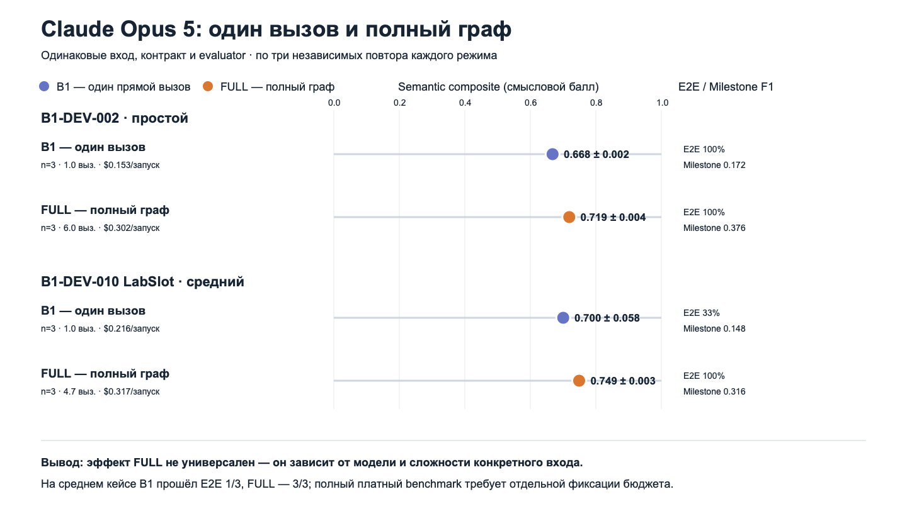

# Gold-разметка, F1-метрики и Claude FULL

## Короткий ответ

`Gold markup` (gold-разметка, эталонная разметка) — это заранее записанное
описание того, **какие смысловые элементы должны присутствовать** в корректном
результате. Это не одна «идеальная картинка» и не требование дословно повторить
текст автора benchmark (тестового набора).

В проекте gold хранит ожидаемых акторов, варианты использования, ключевые этапы
сценария, альтернативные ветки и связи требований с вариантами использования.
Правила эквивалентности разрешают синонимы, переименование, разделение или
объединение UC и другое расположение блоков диаграммы.

## Что именно входит в gold-разметку

Каждый кейс в `benchmark/v1_0_synthetic/cases.json` содержит объект `gold` со
следующими полями:

1. `review_status` (статус проверки) — сейчас
   `synthetic_author_draft`: синтетическая авторская разметка-кандидат. Это
   честно показывает, что разметку ещё следует проверить двумя независимыми
   экспертами перед сильным научным выводом.
2. `actor_slots` (эталонные роли) — канонические акторы и допустимые синонимы.
3. `use_case_slots` (эталонные смысловые слоты UC) — ожидаемая цель, основной
   актор, ключевые этапы, ветвления и исходные ФТ.
4. `required_milestones` (обязательные этапы) — важные бизнес-события сценария,
   а не каждое техническое действие интерфейса.
5. `required_branches` (обязательные ветки) — условие альтернативы или ошибки и
   ожидаемый результат этой ветки.
6. `fr_coverage` (ожидаемое покрытие ФТ) — должно ли каждое функциональное
   требование быть покрыто.
7. `nfr_expectations` (ожидания по НФТ) — какие нефункциональные требования
   нельзя потерять.
8. `trace_expectations` (эталонные связи) — допустимые пары `FR → UC slot`.
9. `known_ambiguity` (известная неоднозначность) — место для явной фиксации
   неоднозначного входа.
10. `forbidden_assumptions` (запрещённые предположения) — детали, которых нет во
    входе и которые считаются неподтверждёнными.
11. `equivalence_policy` (правила эквивалентности) — допустимы ли переименование,
    split/merge (разделение/объединение) UC и линейных узлов, дополнительные
    подтверждённые детали; расположение элементов на картинке игнорируется.

## Почему выбраны именно эти параметры

Они непосредственно отвечают на пять вопросов о качестве результата:

- `Actor` (актор): кто взаимодействует с системой?
- `Use Case` (вариант использования): какую пользовательскую цель поддерживает
  система?
- `Milestone` (ключевой этап): сохранена ли логика основного сценария?
- `Branch` (ветвление): сохранены ли альтернативы, отказы и исключения?
- `Trace` (трассировка): можно ли для результата показать исходное требование?

Эти измерения выбраны не потому, что существует единственная универсальная
формула качества UML, а потому что они покрывают обязательные свойства именно
этой задачи: смысл, сценарий, исключения и проверяемое происхождение. Отдельные
метрики публикуются вместе с общим баллом, чтобы высокий результат одной части
не скрывал дефект другой.

Текущие веса `semantic_composite` (сводного смыслового балла) являются
зафиксированными проектными весами-кандидатами:

`0,15 × Actor F1 + 0,25 × UC F1 + 0,25 × Milestone F1 + 0,15 × Branch F1 + 0,20 × Trace F1`.

- UC и Milestone получили по `0,25`, потому что цель UC и ход сценария — ядро
  создаваемого артефакта.
- Trace получил `0,20`, потому что полная проверяемая связь с требованиями —
  отдельная цель проекта.
- Actor и Branch получили по `0,15`: без них результат неполон, но они не должны
  перевесить основную цель и основной сценарий.

Эти веса нельзя менять после просмотра результатов ради повышения балла. Перед
финальной публикацией их нужно либо подтвердить экспертами, либо показывать
прежде всего пять отдельных F1, используя composite только для компактного
графика.

## Что такое F1

`Precision` (точность) отвечает: какая доля сгенерированных элементов совпала с
ожидаемыми. `Recall` (полнота) отвечает: какая доля ожидаемых элементов была
найдена. `F1` — их гармоническое среднее:

`F1 = 2 × Precision × Recall / (Precision + Recall)`.

Значение `1,0` означает полное совпадение по данному измерению. Значение `0,5`
не означает «диаграмма правильна на 50%»: оно означает конкретный баланс
точности и полноты сопоставляемых смысловых элементов.

## Что такое Milestone F1

`Milestone F1` (F1 ключевых этапов сценария) сравнивает важные события
сгенерированного UC с `required_milestones` из gold. Например, для Event Signup
ожидаются:

1. просмотреть мероприятие;
2. ввести регистрационные данные;
3. получить подтверждение.

Синонимичные формулировки сопоставляются локальной многоязычной моделью
семантического сходства; дословное совпадение не требуется. Низкий Milestone F1
обычно означает одно из двух: обязательные этапы пропущены либо генератор добавил
много более мелких шагов, которые не соответствуют эталонным смысловым слотам.

## Что такое Branch F1

`Branch F1` (F1 альтернативных веток) проверяет условия и результаты
исключений/альтернатив. Для Event Signup gold требует ветку: если email уже
зарегистрирован, система отказывает без создания дубликата. Пропущенная ветка
снижает recall; неподтверждённая дополнительная ветка снижает precision.

## Что такое Trace F1

`Trace F1` (F1 трассировки) сравнивает пары `функциональное требование →
смысловой слот UC`. Recall снижается, если ожидаемая связь потеряна. Precision
снижается, если результат приписывает UC требование, которое его не
подтверждает. В Event Signup ожидаются связи `FR-001 → GUC-001`, `FR-002 →
GUC-001` и `FR-003 → GUC-001`.

Trace F1 по gold и обязательный E2E trace gate (сквозной порог трассировки) —
разные проверки. F1 сравнивает семантическое распределение требований по UC, а
gate требует, чтобы каждый принятый узел/переход диаграммы имел источник либо
явно был помечен неподтверждённым.

## Пример gold для B1-DEV-002 Event Signup

- акторы: `Посетитель`, `Организатор`, с разрешёнными синонимами;
- один смысловой слот UC: `Зарегистрироваться на мероприятие`;
- основной актор: `Посетитель`;
- три обязательных этапа основного сценария;
- одна обязательная ветка повторной регистрации;
- все три ФТ должны быть покрыты этим UC;
- допускаются переименование, split/merge и дополнительные подтверждённые
  детали;
- пиксельное расположение элементов диаграммы не оценивается.

## Результат Claude: B1 и FULL

### Простой B1-DEV-002, три независимых повтора

| Режим | E2E | Semantic mean ± SD | Milestone F1 | Trace F1 | Stability | Токены/запуск | Цена/запуск |
|---|---:|---:|---:|---:|---:|---:|---:|
| B1_ONESHOT | 3/3 | 0,668 ± 0,002 | 0,172 | 1,000 | 0,996 | 11 232 | $0,153 |
| FULL | 3/3 | 0,719 ± 0,004 | 0,376 | 1,000 | 0,991 | 33 910 | $0,302 |

На простом кейсе FULL повысил итоговый балл на `0,051`. Основной измеряемый
выигрыш — более полное совпадение ключевых этапов сценария. Оба режима сохранили
полную трассировку и прошли E2E.

### Средний B1-DEV-010 LabSlot, три независимых повтора

| Режим | E2E | Semantic | Milestone F1 | Trace F1 | Лишние элементы | Вызовы | Токены | Цена |
|---|---:|---:|---:|---:|---:|---:|---:|---:|
| B1_ONESHOT | 1/3 | 0,700 ± 0,058 | 0,148 | 1,000 | 0,511 | 1,00 | 13 986 | $0,216 |
| FULL | 3/3 | 0,749 ± 0,003 | 0,316 | 1,000 | 0,389 | 4,67 | 34 289 | $0,317 |

На среднем кейсе one-shot трижды сформировал JSON и полный набор UC, но дважды
оставил структурно непринимаемые Activity-диаграммы. FULL прошёл E2E 3/3,
повысил semantic на `0,049`, увеличил stability с `0,869` до `0,994` и снизил
долю лишних элементов. В одном повторе FULL обнаружил дефект и выполнил одно
ограниченное исправление. Полный платный benchmark пока не запускается: сначала
нужно зафиксировать набор проектов, бюджет и правило остановки.

Точные причины двух B1-отказов:

- repeat 2: два `activity_edge_untraced`, покрытие элементов Activity `0,962`;
- repeat 3: три `activity_edge_untraced`, покрытие `0,943`;
- обязательный порог равен `1,000`, поэтому оба результата получили
  `activity_trace_coverage_below_threshold` и не были приняты как E2E.

Это не означает, что API-вызовы не состоялись: ответы сохранены и оценены.
Ошибка означает, что не для каждого перехода диаграммы можно доказать источник
в шагах UC. B1 по определению не исправляет ответ; FULL может передать отчёт
валидатора в ограниченный repair-loop.

## Где сохранены значения

- машинно-читаемый JSON:
  `artifacts/claude_b1_full_pilot_2026-09-13/comparison.json`;
- CSV для таблиц и графиков:
  `artifacts/claude_b1_full_pilot_2026-09-13/comparison.csv`;
- полный отчёт:
  `artifacts/claude_b1_full_pilot_2026-09-13/REPORT_RU.md`;
- PNG для презентации:
  `docs/obsidian_vault/assets/31_claude_b1_full_pilot.png`;
- исходные результаты простого FULL ×3:
  `artifacts/benchmark_runs/full-claude-opus5-dev002-r3-combined-2026-09-13/`;
- результаты среднего one-shot и FULL:
  `artifacts/external_model_runs/external-claude-opus5-oneshot-dev010-r3-2026-09-13/`
  и `artifacts/benchmark_runs/full-claude-opus5-dev010-r3-combined-2026-09-13/`.

Все старые результаты сохранены. Диагностический отказ первого несовместимого
FULL-запуска не включён в статистику качества, потому что произошёл до вызова
модели и потратил ноль токенов.
