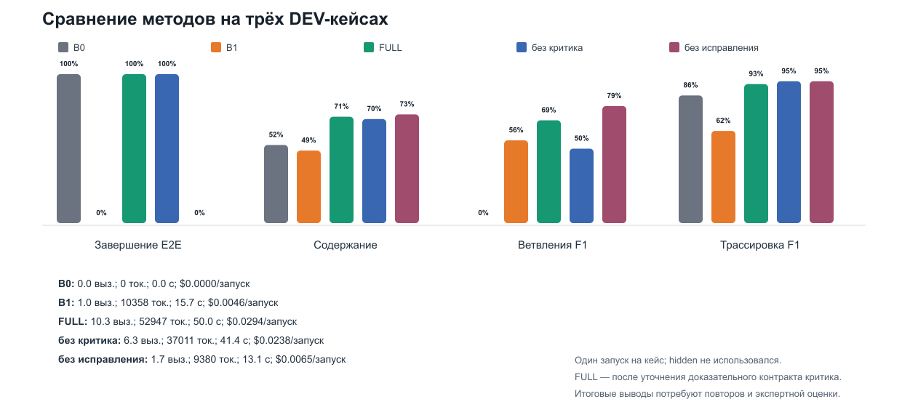
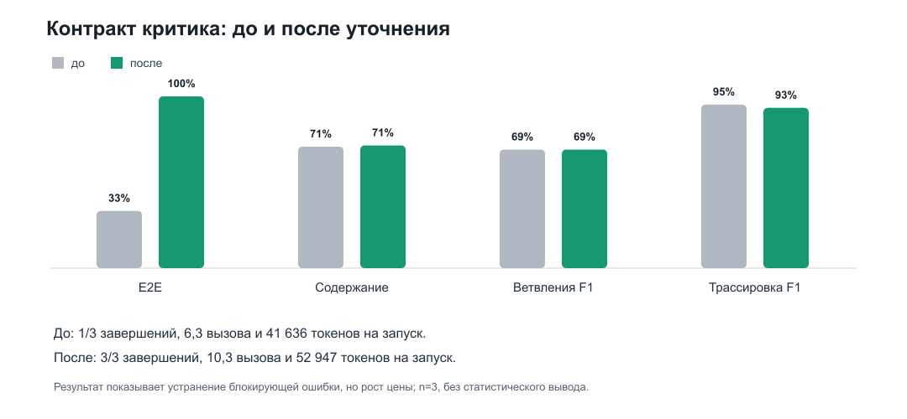

# Экспериментальное сравнение для технологического проекта

Дата фиксации: **11.09.2026**. Статус: **диагностический DEV-пилот**.
Скрытая часть benchmark не открывалась. Числа ниже восстановимы из сохранённых
`results.json`, `results.csv`, `config.json`, `calls.jsonl` и результатов
валидации. Полные запросы и ответы модели не публиковались; сохранены их хэши и
телеметрия без API-ключа.

## 1. Зачем нужны базовые ориентиры

`Baseline` (базовый ориентир) — это заранее зафиксированный более простой
способ решения, относительно которого измеряется цена и польза усложнения.
Фраза «полный граф лучше» допустима только тогда, когда сравнение выполнено при
одинаковом входе, модели, температуре, схеме результата и оценщике.

В работе есть две группы ориентиров:

1. **Прямые:** получают тот же `SpecificationReq` и обязаны вернуть тот же
   комплект типизированных артефактов. Их можно сравнивать общими метриками.
2. **Смежные:** получают уже код или репозиторий и строят другой вид диаграммы.
   Они показывают границу применимости и стоимость другого жизненного этапа,
   но их нельзя честно ранжировать по gold-разметке `SpecificationReq → UC →
   Activity`.

## 2. Что означает каждый метод

| Метод | Вход | Использование LLM | Проверка | Роль в исследовании |
|---|---|---:|---|---|
| `B0_RULE` | `SpecificationReq` | нет | Pydantic и детерминированные правила | нижний ориентир цены, скорости и воспроизводимости |
| `B1_ONESHOT` | тот же `SpecificationReq` | ровно 1 запрос | только итоговый барьер | прямой LLM-ориентир без графа, критика и исправления |
| `FULL` | тот же `SpecificationReq` | несколько запросов | схемы, правила, доказательный критик, ограниченное исправление | исследуемый двухагентный pipeline |
| `FULL_NO_CRITIC` | тот же `SpecificationReq` | несколько запросов | схемы, правила и исправление; без смыслового критика | измерение вклада критика |
| `FULL_NO_REPAIR` | тот же `SpecificationReq` | генерация и критик | исправление запрещено | измерение вклада повторной проверки и исправления |
| `Pyreverse` | существующий Python-код | нет | синтаксический анализ Python | смежный ориентир `code → structure` |
| `GitDiagram` | GitHub-репозиторий | да | проверка графовой структуры и детерминированная компиляция в Mermaid | смежный вариант `repository → architecture graph` |
| `DeepWiki-Open` | репозиторий | да, плюс embeddings/RAG | собственный индекс и генерация wiki/диаграмм | смежный вариант `repository → documentation/wiki` |

### Почему в `B1_ONESHOT` ровно один запрос

Один запрос — это контролируемая экспериментальная граница. Модель должна за
один ответ построить UC, stories, activity-модели и трассировку. Затем результат
проверяется теми же схемами и валидаторами, но модель не получает обратную связь
и не может исправиться. Поэтому разница `B1_ONESHOT` и `FULL` отвечает на
конкретный вопрос: даёт ли граф с промежуточными контрактами и исправлением
дополнительную надёжность по сравнению с одной и той же LLM.

`Один запрос` не означает один токен и не означает один агент. Это одна
HTTP-операция к LLM API, содержащая большой вход и требующая большого
структурированного JSON-ответа. В пилоте один средний запуск использовал 10 358
токенов. Один из трёх ответов достиг ограничения в 8 000 выходных токенов.

### Что именно делает `FULL`

`FULL` использует два агента LangGraph:

1. `Use Case Agent` формирует акторов, варианты использования, основной,
   альтернативные и исключительные сценарии, user stories, system stories и
   ссылки на функциональные требования.
2. `Activity Diagram Agent` преобразует каждый UC в граф действий и решений,
   после проверок детерминированно получает Mermaid.

Внутри каждого агента выполняется цикл:
`generation → schema validation → deterministic validation → semantic critic →
accept / bounded repair / controlled failure`. Корневой оркестратор запускает
Activity Agent только после завершения UC-части, объединяет трассировку и
выполняет сквозную проверку.

### Что означают два варианта без компонентов

- `FULL_NO_CRITIC` сохраняет генераторы, схемы, детерминированные проверки и
  исправление, но отключает смысловой критик. Если вариант не хуже FULL, это
  сигнал, что критерии критика требуют уточнения; это не доказывает, что
  смысловая проверка вообще не нужна.
- `FULL_NO_REPAIR` оставляет проверку, но задаёт `max_repair_attempts=0`.
  Нарушение обнаруживается и честно отражается как контролируемый отказ. Этот
  вариант показывает, нужна ли системе возможность исправлять собственный
  структурированный результат.

## 3. Справедливый протокол пилота

- Кейсы: `B1-DEV-002` (простой, русский), `B1-DEV-010` (средний, русский),
  `B1-DEV-020` (сложный, английский).
- По одному запуску метода на кейс; это 3 результата на метод.
- `B1_ONESHOT`, `FULL`, `FULL_NO_CRITIC` и `FULL_NO_REPAIR` использовали
  `deepseek-flash`, `temperature=0`, `https://api.deepseek.com` и одинаковые
  входы. Ключ читается только из локального `.env`, исключённого из Git;
  контрольный и экспериментальные запросы были успешно приняты API.
- `B0_RULE` получил те же три входа без LLM.
- Оценщик: локальный
  `sentence-transformers/paraphrase-multilingual-MiniLM-L12-v2` плюс
  детерминированные проверки схем, ссылок, структуры и трассировки.
- Hidden test не открывался и не использовался для изменения системы.
- Цены рассчитаны по сохранённым входным/выходным токенам и зафиксированному
  тарифу; это оценка, а не банковская выписка.

## 4. Результаты

| Метод | E2E | Содержание | Branch F1 | Trace F1 | Вызовов | Токенов | Время, с | USD/запуск |
|---|---:|---:|---:|---:|---:|---:|---:|---:|
| `B0_RULE` | 100% | 0,524 | 0,000 | 0,857 | 0,0 | 0 | 0,001 | 0,0000 |
| `B1_ONESHOT` | 0% | 0,487 | 0,556 | 0,619 | 1,0 | 10 358 | 15,7 | 0,0046 |
| `FULL` | 100% | **0,714** | 0,690 | 0,933 | 10,3 | 52 947 | 50,0 | 0,0294 |
| `FULL_NO_CRITIC` | 100% | 0,699 | 0,500 | **0,952** | 6,3 | 37 011 | 41,4 | 0,0238 |
| `FULL_NO_REPAIR` | 0% | 0,730 | **0,786** | **0,952** | 1,7 | 9 380 | 13,1 | 0,0065 |

### Как читать таблицу без ошибочного вывода

1. `B0_RULE` технически завершает все запуски и не тратит токены, но не
   восстанавливает ветвления. Его 100% E2E означает прохождение контракта, а не
   полноту бизнес-смысла.
2. `B1_ONESHOT` дешевле FULL примерно в 6,4 раза по измеренной стоимости, но не
   завершил ни один из трёх сквозных прогонов. Один большой ответ оказался
   недостаточно надёжным для сложного типизированного результата.
3. `FULL_NO_REPAIR` имеет высокий автоматический содержательный балл, однако
   0% E2E: найденные нарушения остались неисправленными. Это прямое
   доказательство пользы ограниченного исправления.
4. `FULL_NO_CRITIC` завершил 3/3 и оказался дешевле FULL. Поэтому нельзя
   заявлять, что критик уже доказан как полезный компонент. Его вклад требует
   повторных прогонов и оценки экспертами.
5. После уточнения контракта критика `FULL` завершил 3/3 и показал лучший
   сводный содержательный балл среди методов, прошедших E2E. Но n=3 слишком мал,
   чтобы объявлять статистическое превосходство.

## 5. Отрицательный результат и исправление критика

Первоначальный критик был сформулирован слишком открыто. После каждого
исправления он мог предъявить новый критерий, не привязанный к конкретному FR,
из-за чего два из трёх FULL-запусков завершались после исчерпания лимита.

Контракт изменён: блокирующее замечание обязано иметь `severity=error`,
`blocking=true`, ссылку на затронутый элемент, конкретный FR или UC step и код
из ограниченного списка проверяемых смысловых нарушений. Стилистические
предпочтения и эквивалентная декомпозиция должны оформляться как
неблокирующее предупреждение.

| FULL | E2E | Содержание | Ветвления F1 | Трассировка F1 | Вызовов | Токенов | USD |
|---|---:|---:|---:|---:|---:|---:|---:|
| До уточнения | 33% | 0,707 | 0,690 | 0,952 | 6,3 | 41 636 | 0,0239 |
| После уточнения | 100% | 0,714 | 0,690 | 0,933 | 10,3 | 52 947 | 0,0294 |

Исправлена блокирующая ошибка, но цена выросла. Это полезный инженерный вывод:
критик должен быть не «ещё одним мнением модели», а доказательным контролем с
фиксированными основаниями. Для итогового вывода нужны повторы и полный DEV20.

## 6. Pyreverse, GitDiagram и DeepWiki: что они делают и экономят ли токены

### Pyreverse

Pyreverse входит в Pylint и строит диаграммы классов и пакетов статическим
анализом Python. Локальный повторный запуск Pylint/Pyreverse 4.0.8 обработал 46
модулей, нашёл 79 import-связей, 64 класса и 33 class relation за 3,52 секунды,
использовав 0 LLM-токенов. Результаты лежат в
`artifacts/baselines/static_analysis_pyreverse/`.

Это самый дешёвый способ получить точную структуру **существующего кода**. Он
не может до написания кода определить бизнес-акторов, цели, исключительные
сценарии или покрытие требований. Поэтому Pyreverse не проигрывает и не
выигрывает FULL в одной задаче: методы дополняют друг друга на разных этапах.

Официальная документация:
[Pyreverse](https://pylint.readthedocs.io/en/latest/additional_tools/pyreverse.html).

### GitDiagram

GitDiagram принимает GitHub-репозиторий, строит архитектурное объяснение, затем
строгий graph AST, проверяет идентификаторы, связность и пути и
детерминированно компилирует результат в Mermaid. Это удобный способ быстро
объяснить структуру готового репозитория. Он **использует LLM**, поэтому нельзя
обещать нулевой расход токенов. Для локального развёртывания официальный проект
требует дополнительные сервисы хранения/очередей и AI provider.

Официальный репозиторий:
[GitDiagram](https://github.com/ahmedkhaleel2004/gitdiagram).

### DeepWiki-Open

DeepWiki-Open клонирует репозиторий, индексирует содержимое, использует
embeddings, RAG и LLM и формирует wiki с диаграммами. Его можно запустить
локально, в том числе с Ollama, но это не «бесплатная детерминированная
генерация»: вычисления и модели остаются, меняется место их выполнения.

Официальный репозиторий:
[DeepWiki-Open](https://github.com/AsyncFuncAI/deepwiki-open).

### Почему для них пока нет общей строки качества

На 11.09.2026 удалённый GitHub URL проекта не открывается без авторизации.
GitDiagram и DeepWiki получают репозиторий, а не `SpecificationReq`, и не
возвращают наш `TraceManifest`. Запускать их на тех же 30 требованиях без
адаптера означало бы изменить задачу. Поэтому в отчёте фиксируются их вход,
выход, наличие LLM, требования к запуску и локальная применимость, но не
выдумываются несопоставимые F1 или токены.

После разрешения публикации корректный дополнительный опыт состоит из двух
частей:

1. передать GitDiagram и DeepWiki один и тот же публичный snapshot
   репозитория, сохранить время, конфигурацию и полученные схемы;
2. дать двум экспертам слепо оценить понятность архитектуры и полезность для
   разработчика по общей пятибалльной рубрике.

Это сравнит инструменты в их реальной задаче `repository → explanation`, не
подменяя основной опыт `requirements → behavior`.

## 7. Что уже доказано и что ещё нельзя утверждать

Доказано сохранёнными данными:

- pipeline исполняется на русском и английском входе разной сложности;
- схемы, детерминированные проверки, трассировка и ограниченное исправление
  работают совместно;
- 56 автоматических тестов проходят;
- 15/15 подготовленных классов искусственных структурных нарушений
  обнаруживаются;
- B0 DEV20 выполнен 60/60 при трёх одинаковых повторах;
- на диагностической тройке исправление необходимо для E2E;
- уточнение критика устранило наблюдавшуюся блокировку 2/3 запусков.

Пока нельзя утверждать:

- что FULL статистически превосходит все прямые ориентиры;
- что достигнут порог ≥90% на полном DEV20 для live FULL;
- что автоматическая семантическая оценка заменяет двух экспертов;
- что GitDiagram или DeepWiki хуже по качеству — у них другой вход и цель;
- что скрытая часть подтверждает выводы: она намеренно не запускалась.

## 8. Что показывать в презентации

1. Слайд «Существующие способы»: разделить `requirements → behavior` и
   `code/repository → structure`.
2. Слайд «Дизайн эксперимента»: одинаковые входы, модель, температура,
   контракты и оценщик для пяти прямых конфигураций.
3. Слайд «Результаты»: изображение `method_comparison_dev3.png` и вывод о цене
   надёжности.
4. Слайд «Разбор компонента»: `critic_before_after.png`, причина ошибки,
   исправленный контракт и рост цены.
5. Слайд «Ограничения»: n=3, один повтор, эксперты и полный DEV20 впереди;
   hidden запечатан.

## 9. Новые источники 2025–2026

- Rahmanian, Sami, Yu. *Large Language Models for Software Engineering
  Diagrams: A Systematic Review of UML and ER modelling*, 2026:
  https://arxiv.org/abs/2607.26100. Обосновывает необходимость стандартных
  benchmark, проверки семантики, воспроизводимости и поведенческих диаграмм.
- Franze et al. *Automated Generation of SysML Activity Diagrams from
  Industrial Requirements Using LLMs*, RE 2026:
  https://conf.researchr.org/details/RE-2026/RE-2026-industrial-innovation-papers/4/Automated-Generation-of-SysML-Activity-Diagrams-from-Industrial-Requirements-Using-LL.
  Показывает практическую ценность поэтапного построения и необходимость
  человеческого уточнения на более детальном уровне.
- Huang et al. *From Use Cases to Sequence Diagrams: Schema-Constrained
  Generation with Large Language Models*, RE 2026:
  https://conf.researchr.org/details/RE-2026/RE-2026-Research-Papers/25/From-Use-Cases-to-Sequence-Diagrams-Schema-Constrained-Generation-with-Large-Languag.
  Поддерживает выбор схем, структурированной генерации и воспроизводимого
  набора пар «сценарий — диаграмма».
- Thakur et al. *Judging the Judges*, GEM 2025:
  https://aclanthology.org/2025.gem-1.33/. Обосновывает отказ от единственного
  LLM-судьи и необходимость автоматических метрик вместе с экспертами.

## 10. Файлы доказательств

- Машиночитаемая сводка:
  `artifacts/technology_project_evidence_2026-09-11/technology_project_experiment_summary.json`.
- Таблица:
  `artifacts/technology_project_evidence_2026-09-11/method_comparison_dev3.csv`.
- Графики: `method_comparison_dev3.png` и `critic_before_after.png` в той же
  папке.
- Исходные live-прогоны после исправления:
  `artifacts/benchmark_runs/full-critic-v2-dev3-deepseek-flash-2026-09-11/`.
- Исходные сравнительные прогоны:
  `artifacts/benchmark_runs/component-comparison-dev3-deepseek-flash-2026-09-11/`.
- B0 на тех же кейсах:
  `artifacts/benchmark_runs/b0-dev3-comparison-2026-09-11/`.
